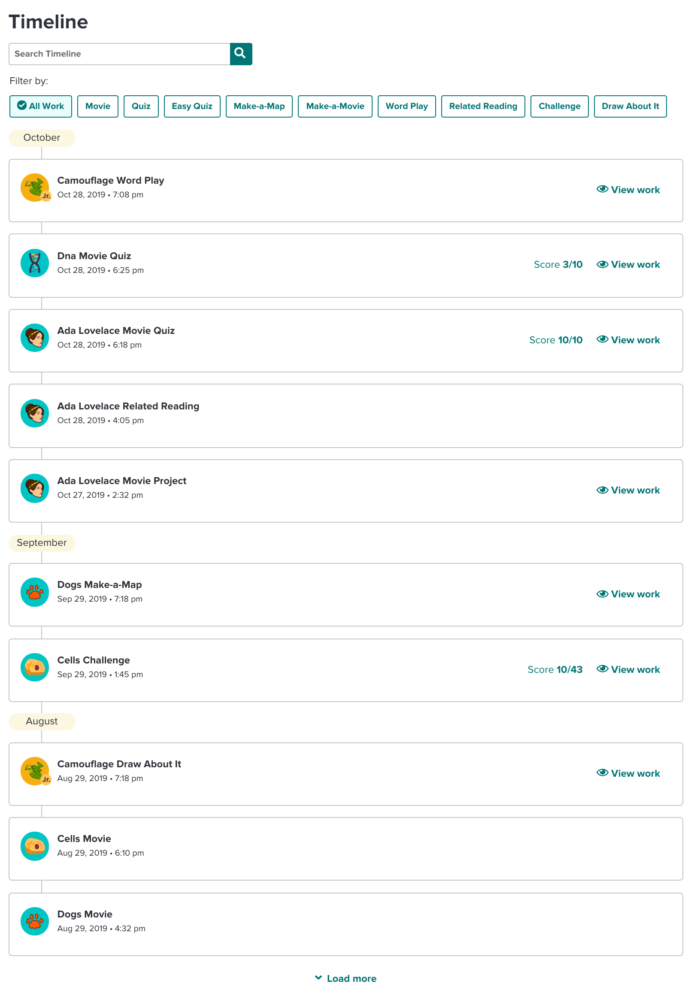
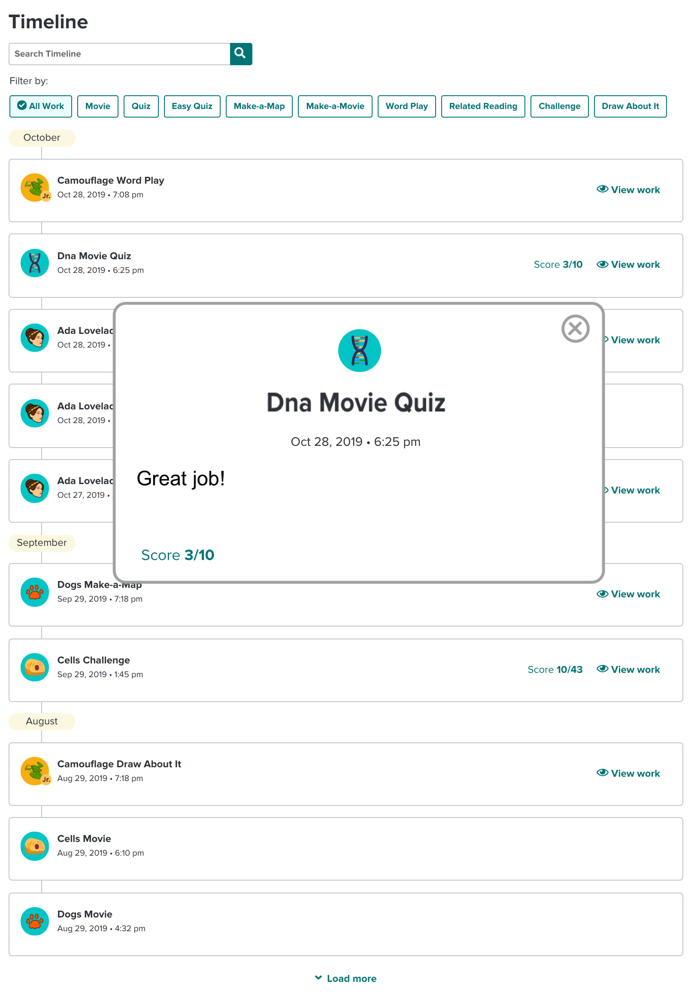

TABLE OF CONTENTS

<!-- @import "[TOC]" {cmd="toc" depthFrom=1 depthTo=6 orderedList=false} -->

<!-- code_chunk_output -->

- [Environment Setup](#environment-setup)
  - [Vue Client](#vue-client)
  - [Server](#server)

<!-- /code_chunk_output -->

# Environment Setup

## Vue Client

1. Navigate to your client folder: `cd {project folder}/client`
2. Install project dependencies: `npm install`
3. Run your dev server. `npm run serve`. Your dev server is ready at http://localhost:8080
   (The dev server defaults to port 8080. If it's taken and it uses a different one you'll need to update your cors settings in the server app.js)

## Server

1. Navigate to your server folder: `cd {project folder}/server`
2. Install project dependencies: `npm install`
3. Run your server. `npm start`. Your server is ready at http://localhost:3000

---

# Screenshots

###Activities view

###Zoom

###Auto-complete

